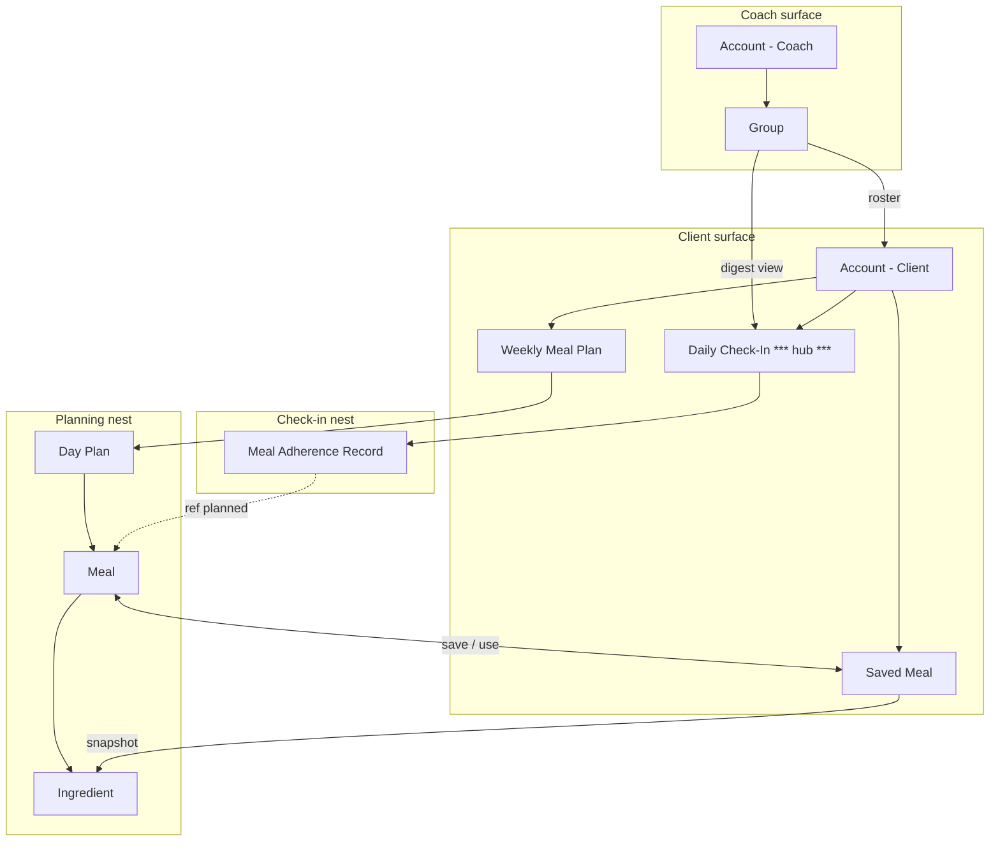

**Project:** Coach-Led Meal Planning MVP

---

## Object Map



---

## Object Cards

### Account
```
┌─────────────────────────┐
│       ACCOUNT           │
├─────────────────────────┤
│ • name                  │
│ • email                 │
│ • role (client/coach)   │
│ • time zone             │
│ • notification prefs    │
│ • created date          │
├─────────────────────────┤
│ Nested: Group           │
│ Nested: Weekly Meal Plan│ (client)
│ Nested: Daily Check-In  │ (client)
│ Nested: Saved Meal      │ (client)
├─────────────────────────┤
│ CTAs: Sign up, Log in,  │
│ Edit profile, Join group│
└─────────────────────────┘
```

### Group
```
┌─────────────────────────┐
│        GROUP            │
├─────────────────────────┤
│ • group name            │
│ • program start/end     │
│ • digest time setting   │
│ • check-in settings     │
├─────────────────────────┤
│ Nested: Account (coach) │
│ Nested: Account[] clients│
│ View: plan status counts│
│ View: daily digest      │
├─────────────────────────┤
│ CTAs: Create, Invite,   │
│ View digest, Filter     │
└─────────────────────────┘
```

### Weekly Meal Plan
```
┌─────────────────────────┐
│   WEEKLY MEAL PLAN      │
├─────────────────────────┤
│ • week start/end        │
│ • status                │
│ • submitted/approved dt │
│ • week macro totals     │
├─────────────────────────┤
│ Nested: Day Plan[]      │
├─────────────────────────┤
│ CTAs: Create, Edit,     │
│ Submit, Copy week,      │
│ Approve, Request changes│
└─────────────────────────┘
```

### Day Plan
```
┌─────────────────────────┐
│      DAY PLAN           │
├─────────────────────────┤
│ • date                  │
│ • day macro totals      │
│ • completion status     │
├─────────────────────────┤
│ Nested: Meal[]          │
├─────────────────────────┤
│ CTAs: Add meal,         │
│ Copy day, View totals   │
└─────────────────────────┘
```

### Meal
```
┌─────────────────────────┐
│         MEAL            │
├─────────────────────────┤
│ • meal name             │
│ • meal type             │
│ • meal notes            │
│ • calories/protein/     │
│   carbs/fat/fiber       │
├─────────────────────────┤
│ Nested: Ingredient[]    │
│ Ref: Saved Meal         │
├─────────────────────────┤
│ CTAs: Add ingredient,   │
│ Save to library, Copy,  │
│ Add from saved          │
└─────────────────────────┘
```

### Ingredient
```
┌─────────────────────────┐
│      INGREDIENT         │
├─────────────────────────┤
│ • name                  │
│ • quantity + unit       │
│ • macros                │
│ • source (manual/DB)    │
│ • user-confirmed        │
├─────────────────────────┤
│ CTAs: Add manual,       │
│ Lookup, Edit, Confirm   │
└─────────────────────────┘
```

### Daily Check-In (Client hub)
```
┌─────────────────────────┐
│   DAILY CHECK-IN  ★     │
├─────────────────────────┤
│ • date                  │
│ • status                │
│ • plan reference        │
│ • submitted date        │
│ • daily notes           │
├─────────────────────────┤
│ Nested: Meal Adherence  │
│         Record[]        │
├─────────────────────────┤
│ CTAs: Mark followed/    │
│ modified/skipped,       │
│ Add deviation, Submit   │
└─────────────────────────┘
```

### Meal Adherence Record
```
┌─────────────────────────┐
│ MEAL ADHERENCE RECORD   │
├─────────────────────────┤
│ • adherence status      │
│ • deviation type        │
│ • deviation notes       │
│ • adjusted macros       │
│ • macro delta           │
├─────────────────────────┤
│ Ref: planned Meal       │
├─────────────────────────┤
│ CTAs: Set status,       │
│ Edit deviation, View    │
│ planned vs actual       │
└─────────────────────────┘
```

### Saved Meal
```
┌─────────────────────────┐
│      SAVED MEAL         │
├─────────────────────────┤
│ • name                  │
│ • ingredient snapshot   │
│ • macro snapshot        │
│ • saved date            │
├─────────────────────────┤
│ Nested: Ingredient[]    │
│         (snapshot)      │
├─────────────────────────┤
│ CTAs: Save, Use, Edit,  │
│ Delete                  │
└─────────────────────────┘
```

---

## Object Summary

| Object | Attributes | Nested Objects | CTAs | Role |
| --- | --- | --- | --- | --- |
| **Account** | 6 | 4 | 5 | Identity + access |
| **Group** | 4 | 2 + views | 7 | Coach program container |
| **Weekly Meal Plan** | 5 | 1 | 9 | Client planning + coach approval |
| **Day Plan** | 3 | 1 | 4 | One day within week |
| **Meal** | 5 | 1 | 8 | Eating occasion |
| **Ingredient** | 5 | 0 | 5 | Accuracy unit |
| **Daily Check-In** | 5 | 1 | 8 | **Client hub** |
| **Meal Adherence Record** | 5 | 0 (refs) | 4 | Per-meal adherence |
| **Saved Meal** | 4 | 1 (snapshot) | 5 | Reuse library |

---

## See Also

* `object-discovery.md` — SIP-validated list
* `nom.md` — Full nesting matrix
* `cta-matrix.md` — Complete action inventory
