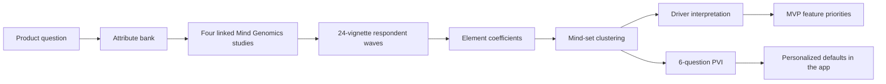
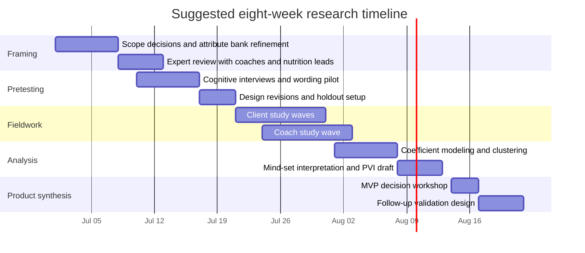

# Mind Genomics Research Framework for a Coach Reviewed Meal Planning PWA

## Executive summary

Howard Moskowitz’s Mind Genomics approach is a strong fit for this product because the product decision is not about a single feature; it is about how users react to **combinations** of workflow choices such as planning granularity, portion entry, approval loops, privacy defaults, and coach notification style. In canonical Mind Genomics, a topic is broken into four questions or “silos,” each with four candidate answers, and respondents rate systematically mixed vignettes built from those elements. The resulting data are decomposed into element-level “drivers,” then clustered into latent “mind-sets” that often cut across demographics. Later, a short Personal Viewpoint Identifier can assign new users to one of those mind-sets for personalization. citeturn16search0turn15search1turn18view0turn18view1turn18view2turn13view3turn14view0turn14view2turn14view3

For this meal-prep planning PWA, the right research program is **not one giant omnibus experiment**. A more rigorous design is a set of linked Mind Genomics studies: one on planning and accuracy, one on reuse and precision aids, one on daily adherence and privacy, and one on coach operations. That structure is consistent with Mind Genomics’ four-by-four design logic and with broader vignette-methodology guidance, which stresses clear factor selection, realistic levels, balanced designs, avoidance of respondent fatigue, and transparent reporting. citeturn18view0turn18view1turn18view2turn17view0turn7view2

If the product behaves like related digital nutrition tools in the literature, the most promising MVP direction is likely to be: **private-by-default coach-client planning, ingredient-and-measurement-first meal plans, strong reuse mechanics such as templates and saved meals, low-friction daily adherence check-ins that capture only deviations from plan, and a once-daily coach digest emphasizing exceptions rather than constant alerts**. That recommendation follows both from likely Mind Genomics hypotheses and from adjacent evidence showing that detailed tracking can reduce engagement, simplified tracking can sustain it, feedback matters, and privacy concerns grow when people are asked to share more specific health-related information. citeturn9view3turn9view4turn9view5turn9view6turn7view6turn7view7

Several implementation details remain **unspecified** by the brief and should be treated as open inputs to the study plan: target geography, whether you are serving licensed dietitians or general nutrition coaches, the nutrition-data source, the regulatory posture of the product, and whether coach review is in-app or link-based in the MVP.

## Mind Genomics and why it fits this product

Moskowitz describes Mind Genomics as an empirical, inductive science aimed at understanding ordinary everyday experience. The key shift is from rating isolated features one at a time to rating **mixed scenarios**, then using regression to infer which underlying statements truly move behavior or preference. That is especially relevant here because users do not experience “barcode support,” “coach approval,” or “daily digest” in isolation; they experience a bundle of defaults and frictions in a workflow. citeturn16search0turn15search1turn18view0turn14view3

In published Mind Genomics implementations, the raw materials are typically four questions with four answers each. Those 16 elements are then combined into 24 systematically generated vignettes per respondent, usually with two to four elements per vignette, never more than one element from the same silo, and each respondent seeing a permuted but mathematically isomorphic version of the design. The design is intended to preserve statistical independence among elements so that individual-level regression can estimate the contribution of each element. citeturn18view0turn12view4turn18view1turn18view2turn18view3

Mind Genomics studies commonly transform a rating scale into a binary “top-box” or “bottom-box” outcome for ease of interpretation, then run ordinary least squares regression on the binary-coded design matrix. Published examples also use k-means clustering on respondent-level coefficient profiles, often with Pearson-based distance, to identify mind-sets. Some studies then create a short six-question Personal Viewpoint Identifier to classify new people into the resulting mind-sets. Response time is also sometimes modeled, not as acceptance, but as a signal of processing or engagement. citeturn18view2turn18view3turn13view0turn13view3turn13view5turn14view0turn14view1turn13view2

That method fits this app unusually well for four reasons. First, your core design problem is combinatorial: planning accuracy, logging burden, coach oversight, and privacy interact. Second, the product has at least two distinct decision-makers, coaches and clients, so demographic slices alone will be weak; mindset segmentation is more likely to reveal the real fault lines. Third, the method is well suited to **early-stage product shaping** before code exists, because vignettes can express workflows and policies before prototypes are fully built. Fourth, once mind-sets are identified, a PVI can later personalize onboarding or defaults inside the app. citeturn14view3turn14view0turn14view2turn7view5

The main methodological caution is scope. Broader experimental-vignette guidance warns that the crucial risk is choosing the wrong factors or unrealistic levels, because pre-specified vignette designs can omit critical variables or create artificial combinations. That is why the attribute bank below should be treated as a **disciplined hypothesis set**, refined through expert review and short qualitative pretests before fielding. citeturn17view0turn7view2

The flow above mirrors the standard Mind Genomics logic of moving from topic framing to elements, from elements to vignette responses, from responses to coefficients, and from coefficients to mind-set-specific product decisions. citeturn18view0turn18view2turn14view0turn14view3

## Candidate attributes and levels

Because canonical Mind Genomics works best with four silos and four elements per experiment, the full product should be represented as a **master attribute bank**, then partitioned into several linked studies rather than one overloaded design. The table below is a recommended starting bank tailored to your MVP and adjacent workflow questions. It is a design proposal, not an empirical result. The structure follows Mind Genomics’ requirement for clear, concrete, mutually exclusive levels and broader vignette guidance to use realistic, decision-relevant levels. citeturn18view0turn18view1turn17view0

| Research family     | Attribute                        | Level A                               | Level B                                        | Level C                                                    | Level D                                                        |
| ------------------- | -------------------------------- | ------------------------------------- | ---------------------------------------------- | ---------------------------------------------------------- | -------------------------------------------------------------- |
| Planning            | Client home surface              | Week grid with macro totals by day    | Today-first checklist with “next meal” focus   | Meal-card board by breakfast/lunch/dinner/snacks           | Step-by-step planning wizard                                   |
| Planning            | Capture method for building plan | Ingredient search first               | Recipe-first entry                             | Natural-language draft to structured ingredients           | Coach-provided meal template first                             |
| Planning            | Accuracy mode                    | Flexible estimate allowed             | Balanced mode requires serving confirmation    | Strict mode requires explicit units for every ingredient   | Coach-enforced accuracy mode by program                        |
| Planning            | Plan granularity                 | Meal names + daily macro targets only | Meal-level macros                              | Ingredient-level with measurements                         | Recipe-level with servings, ingredients, and meal totals       |
| Precision and reuse | Portion input style              | Household units only                  | Grams/oz only                                  | Dual mode household + metric                               | Visual serving cues first, metric optional                     |
| Precision and reuse | Barcode use for packaged foods   | No barcode feature                    | Optional barcode when available                | Barcode strongly prompted for packaged items               | Barcode or nutrition-label entry required when UPC exists      |
| Precision and reuse | Templates and reuse              | No templates                          | Copy previous day or week                      | Coach templates                                            | Personal templates + coach templates                           |
| Precision and reuse | Saved meals                      | No saved meals                        | Save any meal manually                         | One-tap repeat across selected days                        | Repeat meal with portion-adjust prompt                         |
| Adherence           | Daily check-in pattern           | One daily “followed plan or not”      | Meal-level followed / changed / skipped        | Meal-level plus notes                                      | End-of-day review with auto-filled statuses                    |
| Adherence           | Deviation reporting detail       | Free-text only                        | Select change type                             | Select change type + changed ingredients                   | Select change type + changed ingredients + auto-updated macros |
| Adherence           | Client reminders                 | No reminders                          | Morning planning reminder only                 | Meal-time check-in reminders                               | End-of-day completion reminder                                 |
| Trust and access    | Privacy and visibility           | Coach-only by default                 | Coach-only; recipes shareable to group         | Group sees adherence status only                           | Opt-in sharing of selected meals or plans                      |
| Trust and access    | Account and access model         | Full accounts for coach and client    | Client magic link, coach read-only invite link | Client account, coach invite link                          | Temporary private report link with optional account claim      |
| Coach ops           | Approval workflow                | Entire week approved at once          | Day-by-day approval                            | Macro totals approved, meal details advisory               | Exception-based approval on flagged days only                  |
| Coach ops           | Approval states                  | Draft / Submitted / Approved          | Draft / Submitted / Needs changes / Approved   | Draft / Submitted / Approved with warnings / Needs changes | Draft / Submitted / Approved / Changed after approval          |
| Coach ops           | Coach review workspace           | Full plan with inline comments        | Summary first, drill into flagged meals        | Macro dashboard first, meal detail second                  | Queue sorted by risk and missing items                         |
| Coach ops           | Digest frequency                 | Instant per client check-in           | Once daily digest                              | Twice daily digest                                         | Daily digest + weekly trend summary                            |
| Coach ops           | Digest content depth             | Counts only                           | Counts + who checked in                        | Counts + deviations + no-shows                             | Risk-ranked client cards with most important deltas            |
| Coach ops           | Client feedback channel          | In-app comments on weekly plan only   | In-app comments on plan and daily deviations   | Email summary link only                                    | Read-only MVP, coach replies outside app                       |

The attribute bank above is intentionally broader than any single experiment. In practice, each Mind Genomics wave should select only four attributes, preserve one level per attribute per vignette, and ensure that all levels are concrete enough for respondents to imagine real usage. That is consistent with Mind Genomics’ four-question/four-answer pattern and with vignette-methodology recommendations to prioritize realistic, familiar scenarios for the sampled population. citeturn18view0turn18view1turn18view2turn17view0

A useful way to operationalize this bank is to keep the **MVP wording tightly behavioral**. For example, “meal-level plus notes” is better research material than “rich adherence support,” and “client magic link, coach read-only invite link” is better than “lightweight access model.” Mind Genomics coefficients are only as interpretable as the element wording. citeturn14view3turn17view0

## Experiment architecture

### Recommended study program

The cleanest program is four linked studies, each using a standard 4 × 4 Mind Genomics design with 16 elements and 24 permuted vignettes per respondent. That architecture stays close to published Mind Genomics practice while covering the full product surface over multiple waves. citeturn18view0turn18view1turn18view2turn18view3

| Study                     | Primary persona | Objective                                                      | Attributes included                                                                  | Recommended respondent target | Notes                               |
| ------------------------- | --------------- | -------------------------------------------------------------- | ------------------------------------------------------------------------------------ | ----------------------------: | ----------------------------------- |
| Planning and accuracy     | Clients         | Find the most adoptable weekly-plan-building model             | Client home surface, capture method, accuracy mode, plan granularity                 |                       250–300 | Core client experience              |
| Reuse and precision aids  | Clients         | Learn which precision aids reduce burden without harming trust | Portion input style, barcode use, templates/reuse, saved meals                       |                       250–300 | Especially important for repeat use |
| Daily adherence and trust | Clients         | Optimize daily check-ins and privacy defaults                  | Daily check-in pattern, deviation reporting detail, client reminders, privacy/access |                       250–300 | Closest to daily habit loop         |
| Coach operating model     | Coaches         | Optimize review effort and group oversight                     | Approval workflow, approval states, coach review workspace, digest frequency/depth   |                       150–220 | Separate coach language required    |

These targets are recommendations, not fixed rules. Published Mind Genomics papers note that a defined topic can sometimes be studied with as few as 50–100 respondents, and examples in the literature include studies with roughly 100, 219, and 227 respondents. Because your product needs stable coach/client segmentation and several experience subgroups, larger samples are preferable, especially for cluster stability and subgroup interpretation. citeturn14view0turn12view5turn2search14turn0search25

### Recommended respondent task

For each study, each respondent should complete one vignette block in one sitting. Canonical Mind Genomics typically uses 24 systematically generated vignettes, each comprised of two to four elements. Broader vignette guidance also recommends a single session where possible and warns against too many scenarios, which can create fatigue. citeturn12view4turn18view2turn18view3turn17view0

A practical field design is:

- **24 experimental vignettes** scored for analysis
- **2 repeated holdout vignettes** for response consistency and reliability
- **1 comprehension check** before the task using a plain-language example vignette
- **1 realism check** after the task asking whether the scenarios felt plausible for the respondent’s actual workflow

Repeated vignettes are recommended in experimental-vignette guidance to assess reliability, while Mind Genomics’ own standard block size of 24 keeps the task brief enough for intuitive responding. citeturn17view0turn12view4

### Orthogonality, randomization, and control items

Use an isomorphic permuted design if you deploy on BimiLeap or a custom equivalent that preserves the same logic: each respondent receives a different but mathematically equivalent 24-vignette set; each vignette includes no more than one level from the same attribute; and the design remains balanced enough for element-level regression. Published Mind Genomics descriptions explicitly rely on this structure. citeturn12view4turn18view0turn18view2turn18view3

For controls, I recommend three kinds of checks:

1. **Repeated holdouts** to estimate intra-respondent consistency. Experimental-vignette best practices expressly recommend duplicated scenarios for reliability checks. citeturn17view0
2. **Fixed anchor vignette** that represents a plausible “gold standard” workflow, held out from coefficient estimation and shown to everyone. This gives a cross-respondent calibration point.
3. **Fixed friction anchor** that represents a realistic but burdensome workflow. Avoid impossible combinations, because unrealism weakens external validity. That caution is standard in vignette-methodology guidance. citeturn17view0

### Exact recommended vignette wording

The wording below is designed to be concrete, short, and compatible with Mind Genomics’ preference for terse readable elements rather than prose-heavy scenarios. This wording is proposed text for testing, not a published instrument.

**Client introduction**

> You are considering a meal-planning app used with a nutrition coach.  
> Below is one possible version of the app.  
> Each screen description combines a few features of how the app works.  
> Please imagine you would use this app for a real week of meal planning.

**Coach introduction**

> You are considering a meal-planning app for one active client group.  
> Below is one possible version of how the workflow would work for your clients and for you.  
> Please imagine adopting it in your regular coaching practice.

**Sample client vignette**

- You build your week in a grid view showing each day’s meals and total macros.
- For each planned meal, you add ingredients with household units or grams.
- If you change a meal during the day, you only enter what changed and the app updates macros.
- Your daily check-in stays private to you and your coach.

**Sample coach vignette**

- Clients submit full weekly plans before the week begins.
- You review only flagged days that are missing measurements or outside macro targets.
- Clients check in daily as followed, changed, or skipped.
- You receive one daily digest ranking clients by who needs attention first.

### Exact recommended response scales

Mind Genomics often uses a single rating scale plus response time; that is the cleanest design here as well. To avoid overload, run separate parallel samples for different dependent variables rather than asking every respondent to answer many questions after every vignette. Mind Genomics examples commonly use a single five-point or nine-point question and then transform the responses for analysis. citeturn12view4turn18view2turn18view3turn12view5

**Primary client vignette question**

> How likely are you to use this version of the app consistently for the next 8 weeks if your coach asked you to use it?

Scale:  
1 = Not at all likely  
2 = Very unlikely  
3 = Unlikely  
4 = Slightly unlikely  
5 = Unsure  
6 = Slightly likely  
7 = Likely  
8 = Very likely  
9 = Extremely likely

**Primary coach vignette question**

> How likely are you to adopt this version of the workflow for one active client group in the next 60 days?

Scale: same 1–9 anchors as above.

**Recommended parallel-sample secondary question**

> How confident would you be that this version of the app produces nutrition information accurate enough to coach from?

Same 1–9 anchors, with 1 = Not at all confident and 9 = Extremely confident.

**Recommended burden question for a third split sample if budget allows**

> How manageable would this version of the workflow feel in real life?

Scale: 1 = Completely unmanageable to 9 = Extremely manageable.

Running separate samples for intention, accuracy confidence, and burden keeps the task simple while preserving the one-scale rhythm that Mind Genomics uses well. citeturn12view4turn18view2turn18view3

## Participants and recruitment

The most important segmentation decision is not demographics first; it is **role and lived workflow familiarity**. Broader vignette guidance stresses that respondents should approximate the target population and find the scenario familiar, otherwise responses become artificial. Mind Genomics also emphasizes that mind-sets often do not map neatly onto age or gender, so demographics should be collected, but not treated as the primary structure of the analysis. citeturn17view0turn14view0turn14view2turn7view5

| Segment                            | Role definition                                                            |      Suggested quota | Why include                                                    | Recruitment channels                                        |
| ---------------------------------- | -------------------------------------------------------------------------- | -------------------: | -------------------------------------------------------------- | ----------------------------------------------------------- |
| Current coaching clients           | Adults currently working with a coach or dietitian on nutrition            | 35% of client sample | Highest realism for weekly plans and check-ins                 | Coach partner lists, private communities, waitlists         |
| Prospective coaching clients       | Adults interested in nutrition coaching but not currently enrolled         | 25% of client sample | Captures adoption barriers before coaching relationship exists | Prolific, CloudResearch, Meta lead ads                      |
| Experienced self-trackers          | Adults with prior use of MyFitnessPal, Cronometer, MacroFactor, or similar | 20% of client sample | Calibrates expectations around accuracy and burden             | Prolific screeners, Reddit/community outreach, waitlists    |
| Low-tracking / low-structure users | Adults motivated by health goals but with low prior tracking frequency     | 20% of client sample | Essential for finding burden thresholds                        | Prolific, CloudResearch, consumer panels                    |
| Independent coaches                | Nutrition coaches, health coaches, or macro coaches working solo           |  50% of coach sample | Most likely early adopters                                     | LinkedIn lead gen, Meta lead forms, coach networks          |
| Practice-based dietitians          | RDs/RDNs or practice teams using structured plans                          |  30% of coach sample | Higher accuracy and privacy expectations                       | LinkedIn, professional newsletters, referrals               |
| Newer coaches                      | <2 years coaching experience                                               |  20% of coach sample | May value templates and automation more strongly               | Communities, certification alumni groups, social recruiting |

For broad online recruitment, Prolific and CloudResearch both explicitly market participant recruitment for researchers, and LinkedIn and Meta both offer lead-generation workflows that can recruit specialized professional or interest-based audiences. Prolific also supports larger US representative samples, which can be useful if you later want a broader validation wave. citeturn11search0turn11search7turn11search15turn11search1turn11search4turn11search8turn11search6turn11search14turn11search5turn11search9

### Recommended screening variables

Collect, at minimum, the following screening and profiling fields:

- Current role: coach, client, prospective client, both
- Prior experience with meal planning and nutrition logging
- Frequency of packaged-food consumption versus home cooking
- Whether the respondent already works with a coach
- Comfort with measurements such as grams, cups, tablespoons, servings
- Mobile OS, browser, and willingness to install a PWA
- Privacy sensitivity for coach-sharing versus peer-sharing
- Age, gender, region, and education as descriptive controls

These should be used to describe and test external validity, not to replace mindset segmentation. citeturn17view0turn7view5

## Analysis and measurement

### Core analysis pipeline

The canonical Mind Genomics analysis for each study should be:

1. Build the respondent-by-vignette design matrix.
2. Transform the primary 1–9 rating to a top-box binary outcome for the main analysis, such as 7–9 = 100 and 1–6 = 0, or use 8–9 depending on desired stringency.
3. Run respondent-level OLS to estimate one coefficient per element.
4. Cluster respondents on their coefficient vectors to discover mind-sets.
5. Refit aggregate models within each discovered mind-set for interpretation.
6. Build a six-question PVI from the most discriminating elements if the result is actionable enough to deploy. citeturn18view2turn18view3turn13view0turn13view3turn13view5turn14view1turn14view2

I would keep that canonical pipeline, but add a confirmatory layer from the wider vignette literature: because the data have a two-level structure of vignettes nested within respondents, also run multilevel mixed-effects models on the raw 1–9 ratings or on the dichotomized top-box outcome. That produces a more conventional inferential readout alongside the canonical Mind Genomics coefficients. Broader EVM guidance explicitly recommends multilevel modeling for within-person or mixed designs. citeturn17view0

### Clustering strategy

Start with two-, three-, and four-cluster solutions, then choose the smallest solution that is both interpretable and reasonably stable. Published Mind Genomics papers often compare multiple cluster counts and then prefer the one that yields coherent named mind-sets rather than uninterpretable fragments. citeturn13view1turn14view0

For rigor, use:

- k-means on respondent coefficient vectors with Pearson 1-R distance for comparability with published Mind Genomics work
- silhouette and gap-statistic diagnostics as supplementary checks
- bootstrap resampling to assess cluster stability
- split-sample replication if budget allows

This combination respects the published Mind Genomics tradition while reducing the risk of over-reading unstable cluster structures. citeturn13view3turn13view5

### Interaction effects

Mind Genomics is excellent for identifying strong main effects, but interaction claims should be handled conservatively. My recommendation is to pre-register only a small number of substantively important cross-attribute interactions, such as:

- Accuracy mode × portion input style
- Privacy default × sharing model
- Coach review workspace × digest frequency
- Capture method × saved meals

Everything else should be exploratory or pushed into a follow-up validation study. This is consistent with vignette-methodology guidance to avoid overcomplicated designs and with the practical reality that overloading the model makes interpretation weaker. citeturn17view0

### Significance thresholds and reporting

Because you have many element coefficients, I recommend:

- **Primary confirmatory threshold:** two-sided p < .01
- **Exploratory threshold:** false-discovery-rate controlled q < .05
- **Mind-set naming threshold:** require a coherent theme supported by multiple high positive coefficients, not one isolated outlier
- **Replication rule:** any element promoted into the MVP should either replicate in a later wave or survive in both the canonical Mind Genomics and multilevel confirmation models

Transparent reporting is especially important in vignette studies; best-practice recommendations call for detailed disclosure of vignette creation, design, sampling, and materials. citeturn17view0turn7view2

### Recommended metrics and exact survey items

The table below separates **per-vignette metrics** from **post-task metrics**.

| Metric                   | Exact wording                                                                                                            | Role   | Scale         | Use                            |
| ------------------------ | ------------------------------------------------------------------------------------------------------------------------ | ------ | ------------- | ------------------------------ |
| Adoption intent          | “How likely are you to use this version of the app consistently for the next 8 weeks if your coach asked you to use it?” | Client | 1–9           | Primary per-vignette outcome   |
| Workflow adoption intent | “How likely are you to adopt this version of the workflow for one active client group in the next 60 days?”              | Coach  | 1–9           | Primary per-vignette outcome   |
| Accuracy confidence      | “How confident would you be that this version of the app produces nutrition information accurate enough to coach from?”  | Both   | 1–9           | Split-sample secondary outcome |
| Manageability            | “How manageable would this version of the workflow feel in real life?”                                                   | Both   | 1–9           | Split-sample burden outcome    |
| Realism                  | “How realistic did these scenarios feel compared with how you actually plan meals or work with clients?”                 | Both   | 1–7           | Post-task validity check       |
| Weekly burden            | “I could realistically complete this workflow every week without falling behind.”                                        | Both   | 1–7 agreement | Post-task feasibility          |
| Deviation comfort        | “Reporting changes from plan would feel easy rather than annoying.”                                                      | Client | 1–7 agreement | Post-task friction             |
| Coach usefulness         | “This workflow would help me spot who needs attention without overwhelming me.”                                          | Coach  | 1–7 agreement | Post-task operational value    |
| Privacy comfort          | “I would feel comfortable with the default privacy settings shown in these scenarios.”                                   | Both   | 1–7 agreement | Trust and privacy validation   |
| Willingness to recommend | “I would recommend a tool like this to a coach/client I know.”                                                           | Both   | 0–10          | Advocacy signal                |
| Open-ended surprise      | “What, if anything, felt especially appealing or especially frustrating?”                                                | Both   | Open text     | Qualitative explanation        |
| Response time            | Automatically logged per vignette                                                                                        | Both   | Seconds       | Engagement / cognitive effort  |

Mind Genomics studies often collect response time alongside the main rating, and published papers explicitly distinguish response time from acceptance, treating it instead as a processing or engagement signal. That makes it useful here for identifying elements that people dwell on, such as privacy language, strict accuracy requirements, or coach oversight. citeturn13view2

### Visualization plan

Use visuals that mirror the methodological logic:

- coefficient bar charts by total sample and by mind-set
- heatmaps of element coefficients across mind-sets
- additive-constant and top-box probability plots
- response-time salience maps
- coach-versus-client comparison grids
- PVI decision trees once mind-sets stabilize

These outputs make it much easier to translate statistics into product decisions, especially for feature scoping and default selection. citeturn14view3turn13view2

## Implementation roadmap

### Practical field plan

The most reliable implementation is a staged program:

1. **Attribute refinement** with expert review and short interviews
2. **Micro-pilot** to test wording realism and response burden
3. **Main Mind Genomics waves** by persona
4. **Synthesis workshop** that converts drivers into MVP decisions
5. **Follow-up validation** with top candidate bundles and, if warranted, a draft PVI

This sequencing follows both Mind Genomics’ design discipline and broader vignette guidance to ensure that factor levels are realistic and the target population recognizes the scenario as familiar. citeturn18view1turn17view0

### Suggested tooling

If you want the most canonical implementation, BimiLeap is the natural starting point because published Mind Genomics work describes it as a platform for creating, running, analyzing, and disseminating Mind Genomics studies. For screening, custom branching, and post-task measures, pair it with Qualtrics or a similar survey layer. For prototype realism, add lightweight static Figma screens or screenshot excerpts before the vignette block, because vignette-methodology guidance indicates that higher realism can strengthen engagement and external validity. citeturn7view3turn18view1turn17view0

For the product itself, the PWA choice is sensible. MDN and web.dev both describe PWAs as installable, capable of offline and background operation, and able to use service workers, notifications, badges, caching, background sync, and Web Share. Those capabilities align closely with weekly planning, daily check-ins, coach reminders, and shareable review links. citeturn8view0turn7view8turn7view9

### Ethical and privacy notes

Because this product concerns diet, routines, and coach feedback, respondents will likely experience the information as sensitive even if your eventual product does not operate as a HIPAA-covered entity. HHS and FTC both provide specific guidance for consumer health apps, and the FTC explicitly recommends minimizing data, limiting access and permissions, keeping authentication in mind, and building security by design. The FTC’s Health Breach Notification Rule also applies to some health apps outside HIPAA. citeturn7view6turn7view7turn5search0turn5search6

For research operations, that means:

- do **not** collect real meal logs unless necessary for a later prototype test
- use vignette scenarios and role descriptions rather than personal health histories
- pseudonymize respondents and separate incentives from response data
- disclose clearly whether any scenario or prototype data are visible to peers, coaches, or only the research team
- treat privacy defaults as a product question to test, not as an afterthought

This caution is reinforced by recent evidence that privacy concerns about sharing health information vary sharply by how specific the information is and by who may see it. Peer-related privacy concerns can be particularly influential. citeturn9view6turn7view6turn7view7

### Timeline

An eight-week arc is realistic if you keep the first cycle to four tightly scoped studies and avoid mixing product prototyping with the first discovery round. Single-session administration, careful sample matching, and transparent reporting all improve methodological quality. citeturn17view0turn7view2

### Incentives

A practical starting point is:

- clients: 12–15 minute study, modest fixed incentive
- coaches: 12–15 minute study, higher incentive due scarcity and professional time
- optional bonus for completing a follow-up validation study or cognitive interview

The exact amounts are **unspecified** because pricing depends on recruitment channel, field speed requirements, and whether you are recruiting niche professionals or broad consumer samples.

## MVP recommendations

The recommendations below are **prioritized hypotheses** for the MVP, based on Mind Genomics logic, adjacent evidence, and the specifics of your product brief. They should be treated as the starting position to test, not as established findings.

### Private coach-client workflow should be the default

For the MVP, keep plans and daily adherence check-ins visible to the client and coach only. If you want social behavior, confine it to optional recipe sharing later. That recommendation follows from the sensitivity of diet-related data, FTC/HHS guidance for consumer health apps, and evidence that privacy concerns intensify for more specific health information and in peer-sharing contexts. citeturn9view6turn7view6turn7view7

### Build the app around weekly plans, not around daily re-logging

Your concept is strongest when the weekly plan is the source of truth and the daily workflow captures only **adherence versus deviation**. That is both methodologically testable and behaviorally plausible: detailed self-monitoring can be effective, but engagement declines over time, and simplified self-monitoring approaches can maintain far higher day-level participation. citeturn9view3turn9view5

### Accuracy should come from structure and reuse

If the product must aim for accuracy, prioritize ingredient-level plans with measurements, household units plus metric support, barcode for packaged items, and one-tap reuse of saved meals and templates. Accuracy then comes from a high-quality initial plan plus copy-forward behavior, not from forcing users to reconstruct daily eating from scratch. USDA FoodData Central and Open Food Facts both support packaged-food nutrition workflows, which makes barcode a rational precision aid even if it is not the core interaction. citeturn10search0turn10search8turn10search16turn10search2turn10search6

### The daily check-in should be delta-based

The most likely winning adherence pattern is probably:

- followed as planned
- changed it
- skipped it

If changed, the app should ask only what changed and then recalculate the delta from plan. That keeps the daily task light while preserving enough structure for coach review. It also aligns with the literature showing the importance of feedback and the need to sustain self-monitoring engagement rather than maximizing logging effort for its own sake. citeturn9view4turn9view5turn9view3

### Coach notifications should be digest-first, not interrupt-first

A coach should receive a once-daily digest summarizing the group, with emphasis on clients who did not check in, had large deviations, or remain unapproved. Instant notification per client is likely to create noise and lower usefulness. This is a strong feature family to test in the coach study, because coach overload can kill adoption even when client workflows look attractive. The broader feedback literature also suggests that **how** feedback is generated and presented matters, not just whether it exists. citeturn9view4

### Reuse mechanics are probably more important than “smart” capture

If hypothetical results come back with the expected burden pattern, then templates, saved meals, repeat-across-days behavior, and copy-last-week are likely to matter more than flashy but error-prone capture tricks. This is also where a future PVI could become valuable: one mind-set may want strict measured planning, another may want coach templates, and another may want the fastest repeat workflow possible. citeturn14view0turn14view1turn14view3

### Approval states should be explicit and non-silent

A practical MVP state model is:

- Draft
- Submitted
- Needs changes
- Approved
- Changed after approval

That fifth state matters. It protects coach trust by making it visible when a plan has materially changed after approval. It also creates a clean event model for digests, reminders, and later auditability.

### Use a lightweight access model early

For the MVP, a strong default is likely to be **client account plus coach invite or read-only private link**, rather than requiring a full two-sided enterprise setup on day one. A lightweight access model reduces onboarding friction, and with a PWA you can still support install prompts, offline planning, background sync, notifications, and share actions. citeturn8view0turn7view8turn7view9

### A plausible MVP, if the first wave confirms the hypotheses

If the linked studies confirm the likely trade-offs, the MVP should converge on this bundle:

- weekly plan builder with ingredient-level detail and macros
- strong reuse: coach templates, saved meals, repeat days, copy week
- household + metric portion entry
- optional barcode for packaged items
- submit week to coach for approval
- explicit approval states with “changed after approval”
- daily adherence check-ins driven by planned meals
- deviation-only entry with simple structured edits
- private-by-default coach-client visibility
- once-daily coach digest with risk-ranked exceptions
- installable PWA with offline-safe check-ins and shareable private links

That bundle matches the product problem you described, fits the technical affordances of a PWA, and is the most defensible first version to test before adding group sharing, public logs, rich social features, or broad natural-language automation. citeturn8view0turn7view9turn7view6turn9view3turn9view4turn9view6
